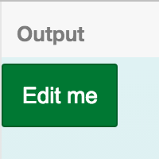
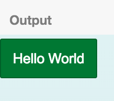
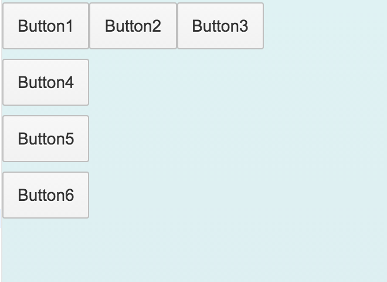
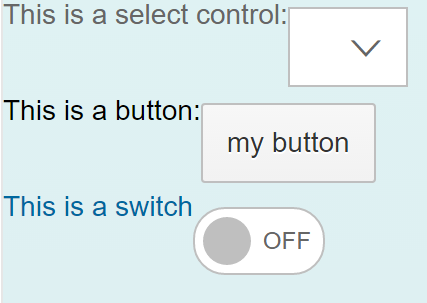
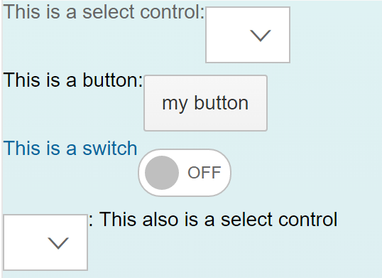
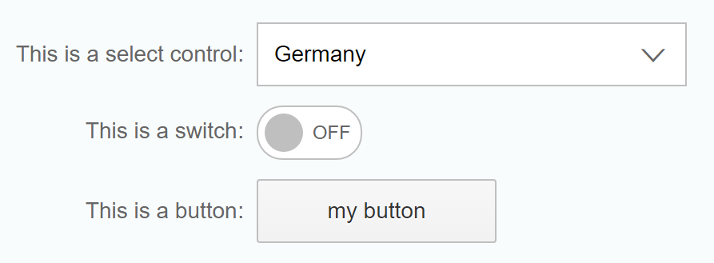
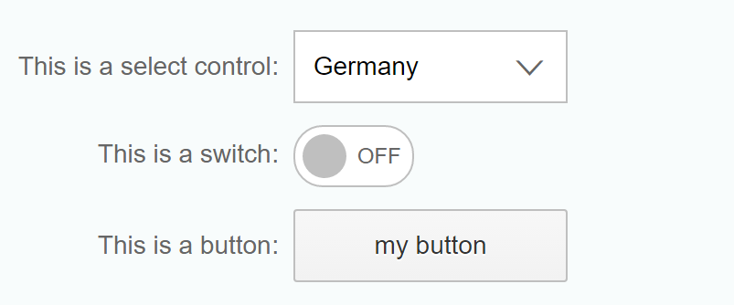
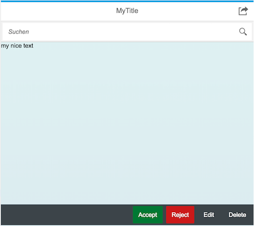
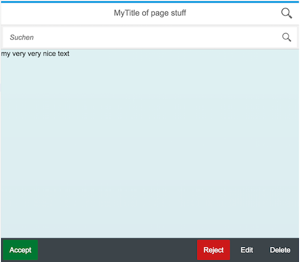

# What how why?
- What: 
 - These are small exercises you can do to learn creating UI5 views using the XML syntax. 
- How: 
 - Choose an exercise
 - Read the instructions
 - Compare the images to see how you are supposed to change the code sample
 - Open the exercise in a new tab
 - Change the code on the left an see the result on the right side
 - OPTIONAL: Experiment with the sample and have a look a the documentation
- Why: 
 - why not?

# Button Basics

Instructions: Change the text of the Button control from "Edit me" to "Hello World"

from  to 

[JS Bin Exercise](http://jsbin.com/kupazaw/9/embed?html,output)

Related OpenUI5 Documentation:
- https://openui5.hana.ondemand.com/#docs/api/symbols/sap.m.Button.html
- https://openui5.hana.ondemand.com/#docs/api/symbols/sap.m.ButtonType.html

# Basic Layouting
from

to

- Open the exercise in a new tab: [Exercise](http://jsbin.com/daveta/11/embed?html,output)

# Basic Layouting 2

from

to

http://jsbin.com/danome/2/embed?html,output

# SimpleForm

from

to

http://jsbin.com/davate/3/embed?html,output

# Page with Buttons

from

to

- Open the exercise in a new tab: [Exercise](http://jsbin.com/hofidir/13/embed?html,output)
- Edit the button definition on the left side of the screen and see the changes on the right side of the screen

Related OpenUI5 Documentation:
- https://openui5.hana.ondemand.com/iconExplorer.html
- https://openui5.hana.ondemand.com/#docs/api/symbols/sap.m.Page.html
- https://openui5.hana.ondemand.com/#docs/api/symbols/sap.m.Toolbar.html
- https://openui5.hana.ondemand.com/#docs/api/symbols/sap.m.ToolbarSpacer.html

# Page with SimpleForm
